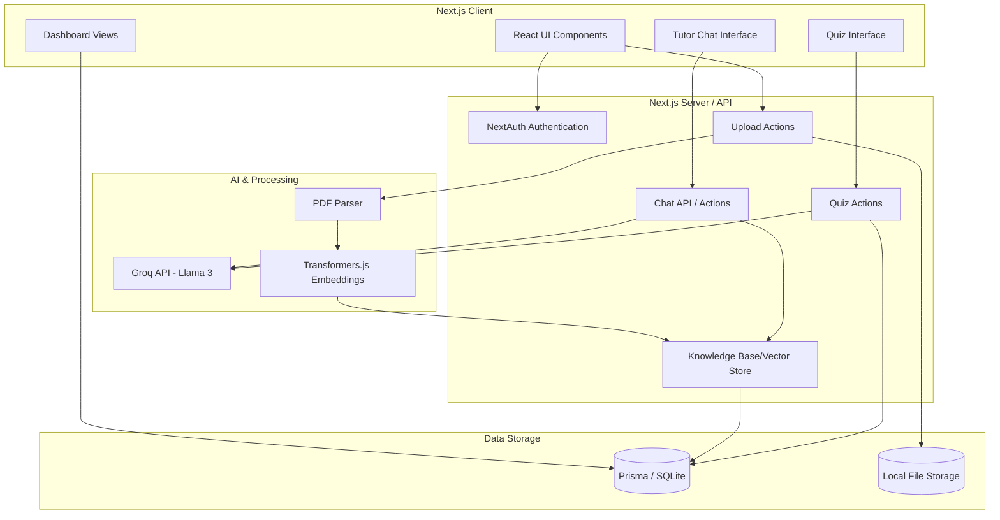

# AI Study Companion Architecture

## Overview

The AI Study Companion is a Next.js 15 application utilizing the App Router. It is designed to process user-uploaded study materials, extract knowledge using AI, and provide a personalized learning experience through a chat interface and adaptive quizzes.

## Architecture Diagram

## Key Architectural Decisions

1. **Next.js 15 App Router & Server Actions:** Chosen for streamlined full-stack development. Server actions allow seamless data mutations without needing separate API routes for everything.
2. **Prisma & SQLite:** Used for the data layer to provide an easy local development setup and rapid prototyping. SQLite avoids the overhead of managing a separate database server during the MVP phase.
3. **Local Embeddings (Transformers.js):** By running embedding generation locally (via Node.js with Transformers.js), the application reduces external API dependency and cost, ensuring faster and more private processing of uploaded documents for the vector store.
4. **Groq (Llama-3):** Groq is used as the LLM provider due to its extremely low latency, which is crucial for real-time chat interactions and on-the-fly quiz generation.
5. **Strict Grounding (RAG):** The AI Tutor is strictly grounded to only answer questions based on retrieved context from the vector store to prevent hallucinations and maintain focus on the provided study materials.
